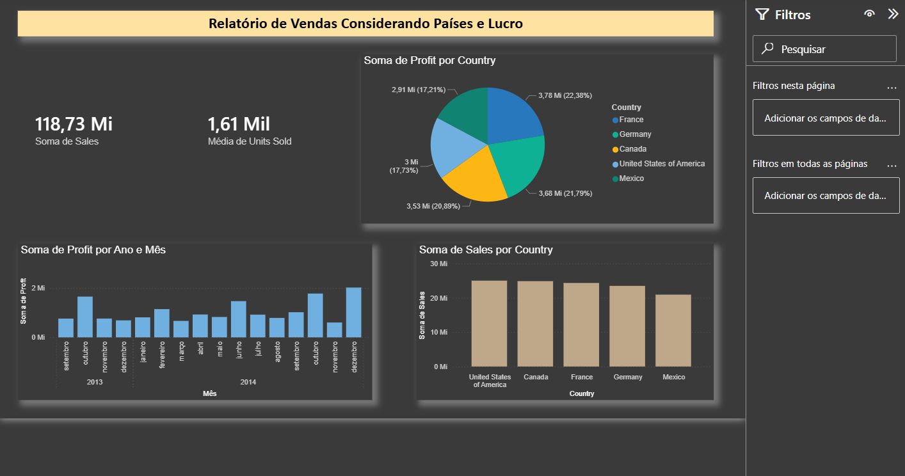
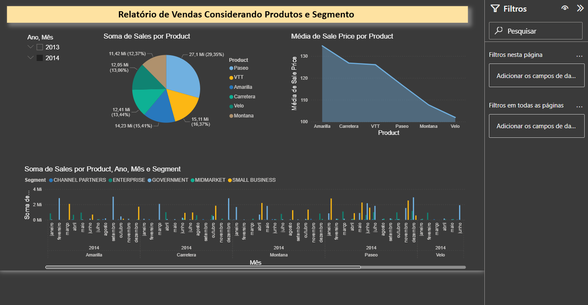

# 📊 Sales Performance Dashboard

Dashboard desenvolvido no **Power BI** com foco na análise de desempenho de vendas,
considerando **países, produtos, segmentos, lucro e unidades vendidas**.

## 🔍 Objetivo do Projeto
Fornecer uma visão clara e estratégica dos resultados de vendas, apoiando a tomada
de decisão através de indicadores e visualizações interativas.

## 🧰 Ferramentas Utilizadas
- Power BI
- Modelagem de dados
- DAX
- Análise exploratória de dados

## 📈 Principais Análises
- Distribuição de vendas, lucro e unidades vendidas por país
- Comparação de desempenho por segmento de mercado
- Análise de vendas por produto
- Evolução do lucro ao longo do tempo (Ano e Mês)
- Indicadores de performance (KPIs)

## 🗂 Estrutura do Dashboard
O relatório é composto por 3 páginas:
1. **Visão Geral de Países e Lucro**
2. **Análise por Produtos e Segmentos**
3. **Distribuição de Vendas, Lucro e Unidades Vendidas**

## 🖼 Prévia do Dashboard

## 📁 Arquivo
- `sales-performance-dashboard.pbix`

## 👤 Autor
**Pedro Sérgio Felinto Rocha**  
Analista de BI
